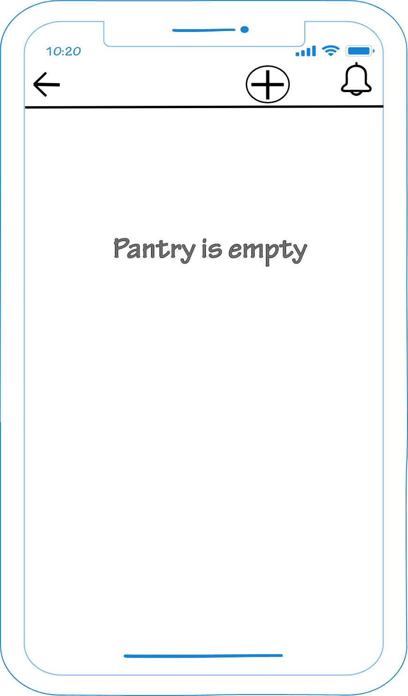
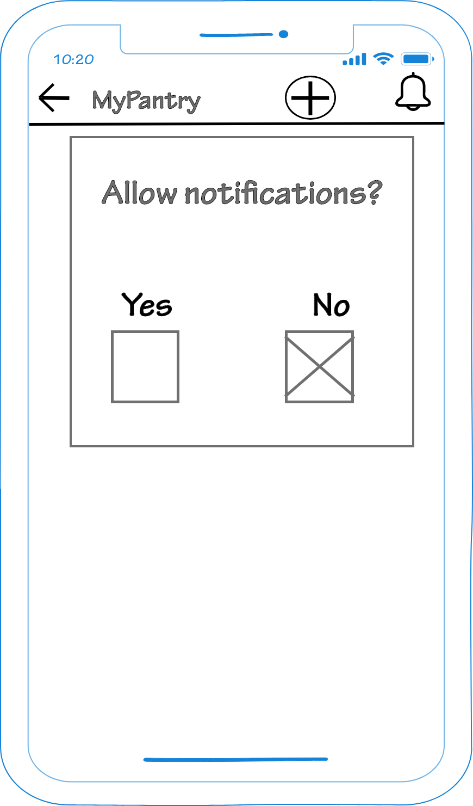

# Wireframes
The home page allows the user to naviate to either their [Pantry](#Pantry) or their [Grocery List](#Grocery-List).

## Pantry
From the Pantry page, the user will be given a few options for interaction depebding on what items they already have listed.  The initial screen will be empty, and only have options for turning on notifications or adding a Pantry Item.

 

## Grocery List
